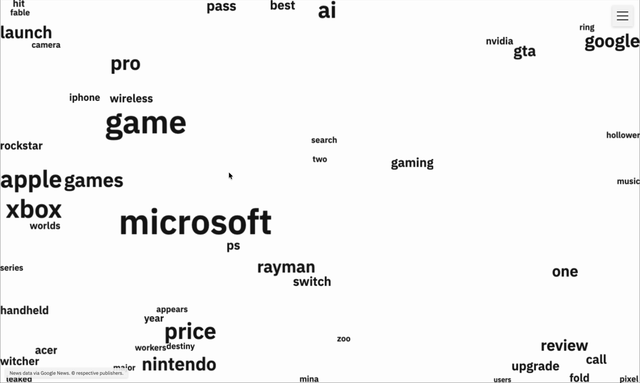

# Word-Float

**Word Float**は、最新ニュース記事から単語の出現頻度を抽出し、物理エンジンを使ってインタラクティブに可視化するWebアプリケーションです。

単語は出現頻度が高いほど大きく表示され、物理演算によって画面内をふわふわと漂います。単語をクリックすると関連ニュースが表示され、現代の情報の流れを直感的に体験できます。




## 特徴

- **動的な単語の可視化**: ニュース記事で頻繁に使われる単語を、その頻度に応じて異なるサイズで表示します。
- **物理ベースのアニメーション**: 単語（オブジェクト）は互いに衝突したり、壁に跳ね返ったりします。
- **インタラクティブな記事連携**: Canvas上の単語をクリックすると、その単語が含まれるニュース記事が画面下部にハイライト表示されます。
- **エディション切替**: 日本 (JP) / 米国 (US) のニュースエディションを切り替えられます。
- **高品質なトークナイズ**: 日本語は SudachiPy (Mode C) による形態素解析で複合名詞（例: 半導体、東京証券取引所）を1語として扱います。英語は拡張ストップワード辞書でノイズを除去します。
- **カスタマイズ可能な設定**: トピック / 表示単語数 / 物理パラメータ（空気抵抗・反発係数）/ 除外単語。


## 技術スタック

- **バックエンド**: Python 3.11+, FastAPI, Uvicorn
- **HTTPクライアント**: httpx (async)
- **RSS解析**: feedparser
- **形態素解析**: SudachiPy + sudachidict_core
- **キャッシュ / レートリミット**: cachetools (TTLCache) / slowapi
- **フロントエンド**: JavaScript, HTML, CSS, Matter.js
- **データ取得**: [Google News RSS](https://news.google.com/)（APIキー不要）


## セットアップ & 実行方法

### 1. リポジトリをクローン
```bash
git clone https://github.com/SabaCan0141/Word-Float.git
cd Word-Float
```

### 2. Python仮想環境の作成と有効化
```bash
# macOS / Linux
python3 -m venv venv
source venv/bin/activate

# Windows
python -m venv venv
venv\Scripts\activate
```

### 3. 依存ライブラリのインストール
```bash
pip install -r requirements.txt
```
`sudachidict_core`（約70MB）が辞書本体ごと自動インストールされます。

### 4. アプリケーションの実行
```bash
uvicorn app.main:app --reload
```

### 5. ブラウザでアクセス
- アプリ: http://127.0.0.1:8000
- API ドキュメント (OpenAPI): http://127.0.0.1:8000/docs
- ヘルスチェック: http://127.0.0.1:8000/api/healthz


## API

| Method | Path | 説明 |
|---|---|---|
| GET | `/api/news?topic=&edition=&limit=` | 単語頻度 + 記事一覧を返す |
| GET | `/api/topics` | 利用可能なトピック一覧 |
| GET | `/api/editions` | 利用可能なエディション一覧 |
| GET | `/api/healthz` | ヘルスチェック |
| GET | `/docs`, `/redoc` | OpenAPI ドキュメント |

- **トピック**: `TOP, WORLD, NATION, BUSINESS, TECHNOLOGY, ENTERTAINMENT, SPORTS, SCIENCE, HEALTH`
- **エディション**: `JP` (日本語), `US` (英語)
- **limit**: 1〜200（デフォルト 50）


## 環境変数

| 名前 | デフォルト | 説明 |
|---|---|---|
| `CACHE_TTL_SEC` | `900` | キャッシュ TTL（秒） |
| `RATE_LIMIT_PER_MIN` | `60` | 1 IP あたりの分間リクエスト上限 |
| `ALLOWED_ORIGINS` | `https://word-float.example` | CORS 許可オリジン（カンマ区切り） |
| `HTTP_TIMEOUT_SEC` | `10` | 外部 HTTP タイムアウト（秒） |
| `LOG_LEVEL` | `INFO` | ログレベル |


## デプロイ

PaaS (Render / Railway / Fly.io 等) を想定しています。

- ビルド: `pip install -r requirements.txt`
- 起動: `uvicorn app.main:app --host 0.0.0.0 --port $PORT`
- ヘルスチェックパス: `/api/healthz`
- HTTPS は PaaS 側で有効化してください。


## 使い方
1. **単語の操作**: Canvas内の単語はマウスでドラッグして動かせます。
2. **関連記事の表示**: 単語をクリックすると、画面下の「Articles」セクションに関連記事がハイライトされます。記事カードをクリックすると元のニュースサイトが新しいタブで開きます。
3. **設定の変更**: ハンバーガーメニューから設定パネルを開き、値を変更後「Reload」ボタンを押すとCanvasに反映されます。


## ファイル構成
```
Word-Float/
├─ pyproject.toml          # 依存定義 + ビルド設定
├─ requirements.txt        # デプロイ用依存定義
├─ app/
│  ├─ main.py              # FastAPI エントリポイント
│  ├─ config.py            # 環境変数読み込み (Pydantic Settings)
│  ├─ cache.py             # TTLCache ラッパ（2層）
│  ├─ limiter.py           # slowapi レートリミッタ
│  ├─ schemas.py           # Pydantic モデル / Topic・Edition enum
│  ├─ services/
│  │  ├─ rss.py            # Google News RSS 取得
│  │  ├─ cleaner.py        # HTML / URL / エンティティ正規化
│  │  └─ tokenizer.py      # JA (Sudachi Mode C) / EN トークナイズ
│  └─ routers/
│     └─ news.py           # /api/news 等
├─ static/                 # script.js, style.css, noimage.png
└─ templates/
   └─ index.html
```


## クレジット・免責

- 本アプリケーションは**非商用の個人プロジェクト**です。
- ニュースデータは **Google News** から取得しています。各記事の著作権は配信元（各出版社）に帰属します。本文の転載は行わず、見出し・抜粋のみを表示し、元配信元へのリンクを保持します。
- Google News の robots.txt および利用規約を尊重するため、(トピック, エディション) ごとに 15 分の TTL キャッシュとレートリミット (60 req/min) を設けています。


## ライセンス

[MIT License](LICENSE)
